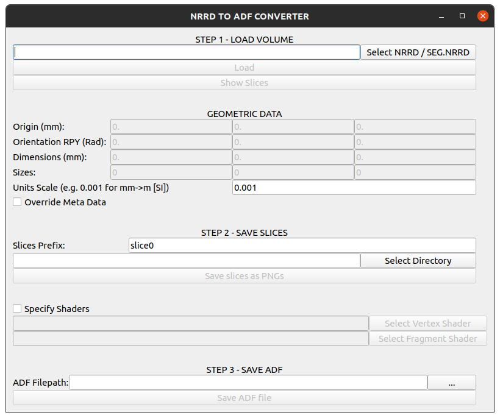

# CONVERT NRRD AND SEGMENTATION NRRD FILES TO ADF FILES

# USAGE

## GUI:
Run the GUI using the following command in a terminal
```bash
python3 nrrd_to_adf_gui.py
```
<p style="text-align: center"></p>

## Command line:
Run the Python script with the command line options

```bash
python3 nrrd_to_adf.py -n volume.nrrd -a volume.yaml
```

Check the available options via:

```bash
python3 nrrd_to_adf.py -h
```


|#    |Option   |Description   |
|-----|---------|--------------|
|-h   |Help     | Show help    |
|-n   |NRRD or Seg NRRD filepath| Provide the *.nrrd or *.seg.nrrd filepath to be loaded|
|-a   |ADF filepath| Provide the *.yaml AMBF Description filepath to be saved|
|-p   |Optional slices prefix| Optional prefix to be appended to saved slices|
|--slices_path   |Optional Path for slices| Provide a path for the slices|