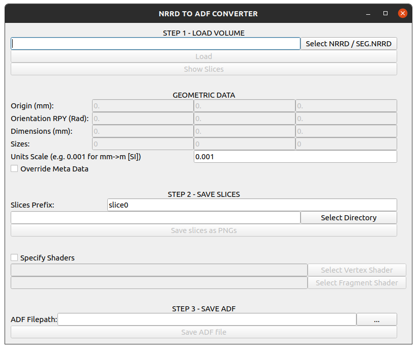

# CONVERT NRRD AND SEGMENTATION NRRD FILES TO ADF FILES

Tools to convert NRRD volumes to ADF files for AMBF simulations.

<!--toc:start-->
- [CONVERT NRRD AND SEGMENTATION NRRD FILES TO ADF FILES](#convert-nrrd-and-segmentation-nrrd-files-to-adf-files)
  - [Functionality 1: nrrd to ADF conversion](#functionality-1-nrrd-to-adf-conversion)
    - [GUI:](#gui)
    - [Command line:](#command-line)
  - [Functionality 2: Update nrrd with set of images](#functionality-2-update-nrrd-with-set-of-images)
<!--toc:end-->


## Functionality 1: nrrd to ADF conversion 

**Summary:**

### GUI:
Run the GUI using the following command in a terminal
```bash
python3 nrrd_to_adf_gui.py
```
<p style="text-align: center"></p>

### Command line:
Run the Python script with the command line options

```bash
python3 nrrd_to_adf.py -n volume.nrrd -a volume.yaml
```

Check the available options via:

```bash
python3 nrrd_to_adf.py -h
```


|#    |Option   |Description   |
|-----|---------|--------------|
|-h   |Help     | Show help    |
|-n   |NRRD or Seg NRRD filepath| Provide the *.nrrd or *.seg.nrrd filepath to be loaded|
|-a   |ADF filepath| Provide the *.yaml AMBF Description filepath to be saved|
|-p   |Optional slices prefix| Optional prefix to be appended to saved slices|
|--slices_path   |Optional Path for slices| Provide a path for the slices|

## Functionality 2: Update nrrd with set of images 

**Summary:**
Use `update_seg_nrrd_data_from_pngs.py` to update `.seg.nrrd` file with png
slices from a volume. Useful to observe changes in the volume in 3D slicer
Tested on Slicer `5.8.1` and Ubuntu 24.04

**Usage:**

```bash
python update_seg_nrrd.py \
    -n data/testing_data_cynthia/seg_post.seg.nrrd \
    -s data/testing_data_cynthia/seg_post.seg_slices \
    -p slice0 \
    -o seg_post_updated.seg.nrrd
```

